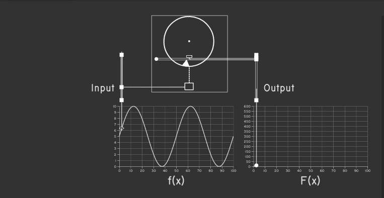

# Differential Analyzer
A d3.js visualization of a mechanical integrator, the key component of Vannevar
Bush's differential analyzer.

## Running Locally
Make sure you have the [Yarn Package Manager](https://yarnpkg.com/) installed.
Then run:
```
$ yarn install
$ yarn serve
```

## Deployment
```
$ yarn build
$ ./deploy.sh
```

## Demo

